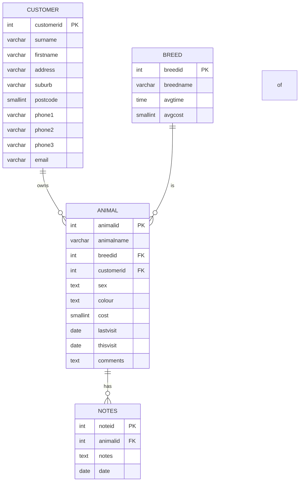

- **Project Name**: ppdb-api
- **Goal/Purpose**: To provide a RESTful API for managing customer, animal, breed, and note data for a pet care application.
- **Target Audience**: Developers building pet care applications that require backend data management.

---

#### Features

- **Core Features**:
  1. [x] User authentication and authorization using API keys.
  2. [x] CRUD operations for customers, animals, breeds, and notes.
  3. Retrieving related data (e.g., all animals for a customer, all notes for an animal).
  4. Search functionality across customer surnames, animal names, and phone numbers.
- **Optional Features**:
  1. Pagination for list results.
  2. Advanced filtering and sorting options for data retrieval.

---

#### Functional Specification

1. **User Roles and Permissions**:
   - [x] All users must authenticate using a valid API key.
   - [x] Authenticated users have full access to all API endpoints and operations.

2. **User Journeys/Flows**:
   - [x] Users will interact with the API programmatically, sending HTTP requests to the appropriate endpoints with the required data.
   - [x] For each operation (e.g., create, read, update, delete), users will provide the necessary data in the request body (for POST/PUT) or query parameters (for GET/DELETE).

3. **Application Pages/Endpoints**:
   - Customers:
     - [x] `GET /customers` - Retrieve all customers
     - [x] `GET /customers/:id` - Retrieve a specific customer
     - [x] `POST /customers` - Create a new customer
     - [x] `PUT /customers/:id` - Update a customer
     - [x] `DELETE /customers/:id` - Delete a customer
   - Animals:
     - [x] `GET /animals` - Retrieve all animals
     - [x] `GET /animals/:id` - Retrieve a specific animal
     - [x] `GET /customer/:id/animals` - Retrieve all animals for a customer
     - [x] `POST /animals` - Create a new animal
     - [x] `PUT /animals/:id` - Update an animal
     - [x] `DELETE /animals/:id` - Delete an animal
   - Breeds:
     - [x] `GET /breeds` - Retrieve all breeds
     - [x] `GET /breeds/:id` - Retrieve a specific breed
     - [x] `POST /breeds` - Create a new breed
     - [x] `PUT /breeds/:id` - Update a breed
     - [x] `DELETE /breeds/:id` - Delete a breed
   - Notes:
     - [x] `GET /notes` - Retrieve all notes
     - [x] `GET /notes/:id` - Retrieve a specific note
     - [x] `GET /animal/:id/notes` - Retrieve all notes for an animal
     - [x] `POST /notes` - Create a new note
     - [x] `PUT /notes/:id` - Update a note
     - [x] `DELETE /notes/:id` - Delete a note
   - Search:
     - [x] `GET /search?q=query` - Search across customer surnames, animal names, and phone numbers

4. **Data Models**:
   - [x] Customer:
     - `customerid` (integer, primary key)
     - `surname` (string, required)
     - `firstname` (string)
     - `address` (string)
     - `suburb` (string)
     - `postcode` (integer)
     - `phone1` (string)
     - `phone2` (string)
     - `phone3` (string)
     - `email` (string)
   - [x] Animal:
     - `animalid` (integer, primary key)
     - `animalname` (string, required)
     - `breedid` (integer, foreign key to Breed)
     - `customerid` (integer, foreign key to Customer)
     - `sex` (string, required)
     - `colour` (string, required)
     - `cost` (integer, required)
     - `lastvisit` (date, required)
     - `thisvisit` (date, required)
     - `comments` (string)
   - [x] Breed:
     - `breedid` (integer, primary key)
     - `breedname` (string, required, unique)
     - `avgtime` (time)
     - `avgcost` (integer)
   - [x] Note:
     - `noteid` (integer, primary key)
     - `animalid` (integer, foreign key to Animal)
     - `notes` (string, required)
     - `date` (date, required)

5. **Error Handling**:
   - [x] API will return appropriate HTTP status codes for errors (e.g., 400 for bad requests, 404 for not found, 500 for server errors).
   - [x] Detailed error messages will be provided in the response body to aid debugging.

6. **Third-Party Integrations**:
   - [x] None currently required.
   
7. **Database Host**:
   - [x] The Postgresql Database is already created and populated with example data, the database connection details are to be stored in an .env file and loaded by the app at runtime, the .env will contain
   - dbHost: the IP address of the Postgresql database server
   - dbPort: the port to connect to (default is 5432)
   - dbUser: the username to use to connect
   - dbPass: the password to use to connect for user dbUser
   - dbName: the name of the database to connect to

```env.example
dbHost=10.10.10.204
dbPort=5432
dbUser=temp
dbPass=pass1234
dbName=ppdb-api
```

---

#### Technical Specification

- [x] **Platform/Technologies**: Node.js, Express.js, PostgreSQL, Sequelize ORM
- [x] **Architecture**:
  - [x] **Backend**: 
    - Express.js server with routes for each API endpoint
    - Sequelize ORM for interacting with the PostgreSQL database
    - Middleware for authentication, error handling, and request validation
  - [x] **Security Measures**:
    - API key-based authentication using custom middleware
    - Input validation and sanitization to prevent SQL injection and other attacks
    - HTTPS encryption for all API traffic
- [x] **Development Tools**:
  - Node.js version 14+
  - PostgreSQL version 12+
  - Sequelize CLI for database migrations and seeding
  - Postman or Insomnia for API testing

---

#### Integration Specification

- [x] **External APIs**: None currently required.

- [x] **Custom API Usage**:
  - [x] **Endpoints**: As detailed in the "Application Pages/Endpoints" section above.
  - [x] **Authentication**: 
    - API key must be provided in the `X-API-Key` header of each request.
    - API keys will be generated and assigned to users manually by administrators.

---

#### Additional Documentation

- **Diagrams**: 
  - [x] [ERD for the database schema]
